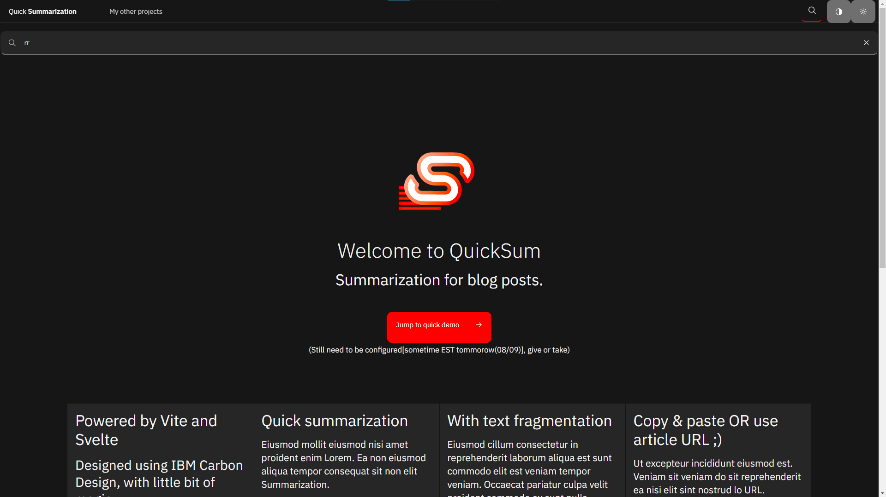

# quicksum

## Copyright (c) 2021 Yonah Aviv


_Quick article summarization(try it now!) with text fragmentation(coming soon)._

## Table of Contents

- [About](#about)
- [Getting Started](#getting_started)
- [Usage](#usage)
- [Contributing](../CONTRIBUTING.md)

## About <a name = "about"></a>

Paste a body of text (i.e., an article, essay, etc.) and QuickSum will generate a summary of it for you. Coded using Svelte


- Currently only pasting the actual text in the textarea will work, meaning no URLs.

(the following is a WIP)





## Getting Started <a name = "getting_started"></a>

These instructions will get you a copy of the project up and running on your local machine for development and testing purposes. See [deployment](#deployment) for notes on how to deploy the project on a live system.

### Prerequisites

What things you need to install the software and how to install them.

- NodeJS
- pnpm
- Terminal(powershell, bash, command prompt etc.)
```

```

### Development

A step by step series of examples that tell you how to get a development env running.


1. Clone repo
2. In the root of the cloned folder:
3.
Install dependencies using pnpm

```
pnpm i
```

Run dev server using webpack

```
pnpm run start
```

```navigate to localhost:3000
```
- Live reloading still needs to be added****

End with an example of getting some data out of the system or using it for a little demo.

## Usage <a name = "usage"></a>

Add notes about how to use the system.
